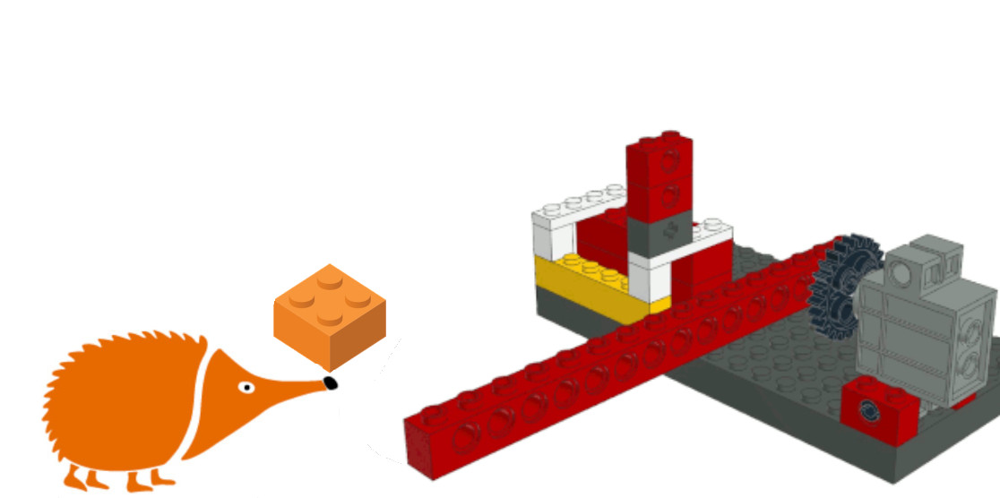
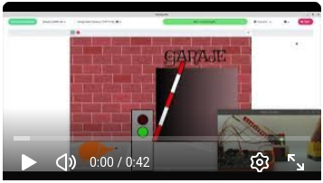

# Barrera Automática

Barrera automática para el control de acceso de vehículos con bloques de construcción, sensor de IR y la placa EchidnaBlack2. 

El sensor de infrarrojos conectado a la entrada A2 detecta la presencia de un vehículo detenido frente a la barrera y activa la secuencia de automatización: un servomotor eleva la barrera mientras el semáforo cambia de rojo a verde mediante LEDs externos, indicando que el paso está permitido. Cuando el vehículo avanza y deja de ser detectado, el sistema introduce un breve tiempo de espera de seguridad antes de bajar de nuevo la barrera y restablecer el estado inicial del semáforo.

Sensores: Sensor distancia infrarrojos

Actuadores: Servomotor de posición

## Guía de montaje

- [Instrucciones en PDF](BarreraAutomatica.pdf)

- [Archivo CAD montaje](BarreraAutomatica.gif.ldr)

- [Gif animado del montaje](BarreraAutomatica.gif)

- [Listado de piezas](BarreraAutomatica.cvs)

## Proyecto en EchidnaML

[Archivo .sb3 para EchidnaML](barreraAutomatica.sb3)

## Vídeo

