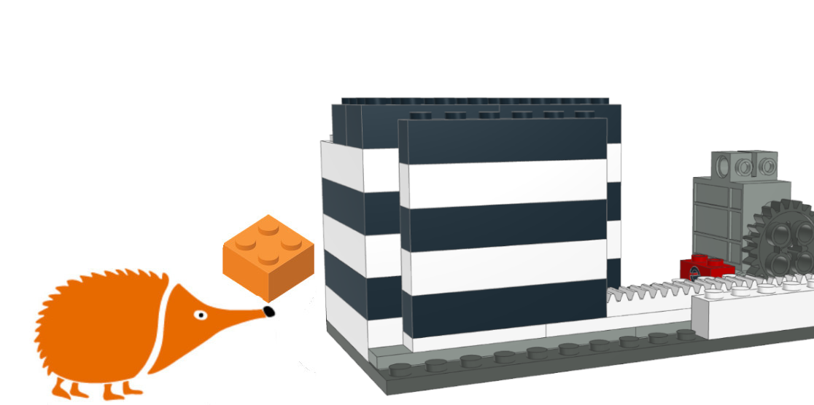
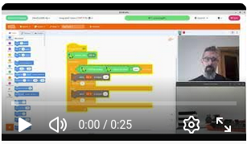

# Caja Fuerte

Caja de apertura mecánica con bloques de construcción y la placa EchidnaBlack2. El modelo se abre gracias a un engranake que arrastra una base dentada. Se proponen tres métodos de apertura diferente: mediante un pulsador de apertura y otro de cierre, mediante clave con los conectores MKMK y mediante reconocimiento facial con un modelo de imágenes de LearningML.

Sensores: Pulsadores

Actuadores: Servomotor de posición

## Guía de montaje

- [Instrucciones en PDF](cajafuerte_150_DPI.pdf)

- [Archivo CAD montaje](cajafuerte.ldr)

- [Gif animado del montaje](CajaFuerte/cajafuerte.gif)

- [Listado de piezas](cajafuerte.cvs)

## Proyecto en EchidnaML

- [Archivo .sb3 pulsadores](caja%20fuerte%201.sb3)
- [Archivo .sb3 clave](caja%20fuerte%202.sb3)
- [Archivo .sb3: machine learning](caja%20fuerte%203.sb3)

## Vídeo

