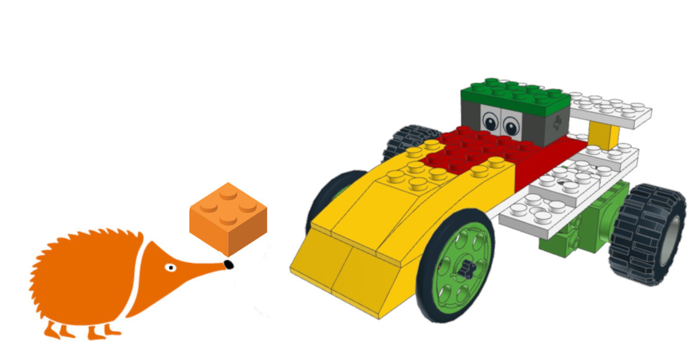
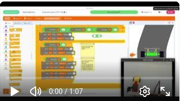

# Coche Teledirigido

Proyecto de coche teledirigido desarrollado con bloques de construcción y la placa EchidnaBlack2. El modelo se desplaza mediante dos servomotores de rotación continua, uno por cada rueda motriz, lo que permite implementar un control diferencial para avanzar, retroceder y girar.

El control del vehículo se realiza con el joystick integrado en la EchidnaBlack2, utilizando su eje vertical para el movimiento adelante/atrás y el eje horizontal para girar.

## Guía de montaje

- [Gif animado con las instrucciones paso a paso](CocheTeledirigido.gif)

- [Instrucciones en PDF](CocheTeledirigidoLPub3D_150_DPI.pdf)

## Proyecto en EchidnaML

[Descarga el archivo .sb3 para EchidnaML](CocheTeledirigido.sb3)

## Vídeo

