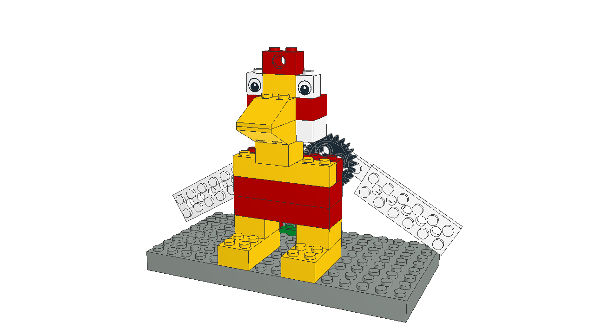
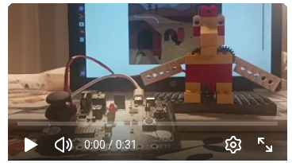

# Gallo Despertador

Este proyecto consiste en la construcción de un gallo con bloques de construcción que mueve las alas y canta cuando amanece. La estructura se basa en piezas de un kit clásico, combinadas con engranajes accionados por un *servomotor*.  
La *LDR* (sensor de luz) detecta el ciclo día–noche: durante la oscuridad el sistema permanece en espera y, cuando la luz supera el umbral de amanecer, el gallo se activa.

Sensores: LDR

Actuadores: Servomotor de posición

## Guía de montaje

[Instrucciones en PDF](gallodespertador.pdf)

[Archivo CAD montaje](gallodespertador.ldr)

## Proyecto en EchidnaML

[Archivo .sb3 para EchidnaML](Gallo-despertador.sb3)

## Vídeo

