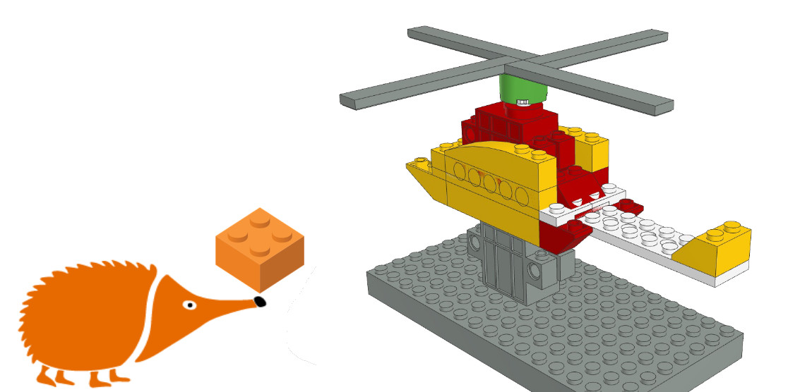
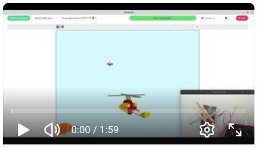

# Helicóptero con acelerómetro

En este proyecto con bloques de construcción se ha creado un helicóptero que combina movimiento físico y representación virtual. El modelo cuenta con una hélice accionada por un motor de corriente continua y un giro lateral controlado por un servomotor.
El movimiento a izquierda y derecha se controla mediante el acelerómetro integrado en la placa, haciendo que el helicóptero responda directamente a la inclinación de la misma. Esta misma información del acelerómetro se reutiliza en una versión virtual del modelo, integrada como avatar en un pequeño videojuego programado en EchidnaML.

En el juego, el helicóptero se desplaza por la pantalla para esquivar patos que aparecen volando, conectando de forma directa el mundo físico y el digital.

## Guía de montaje

- [Instrucciones gif](HelicopteroAcelerometroLPub3D.gif)

- [Instrucciones PDF](HelicopteroAcelerometroLPub3D.pdf)

- [Lista de piezas](HelicopteroAcelerometroLPub3D.cvs)

## Archivo EchidnaML

- [Archivo sb3](Helic%C3%B3ptero%20Aceler%C3%B3metro.sb3)
- [Archivo sb3 control maqueta](HelicopteroMaqueta.sb3)

## Vídeo

