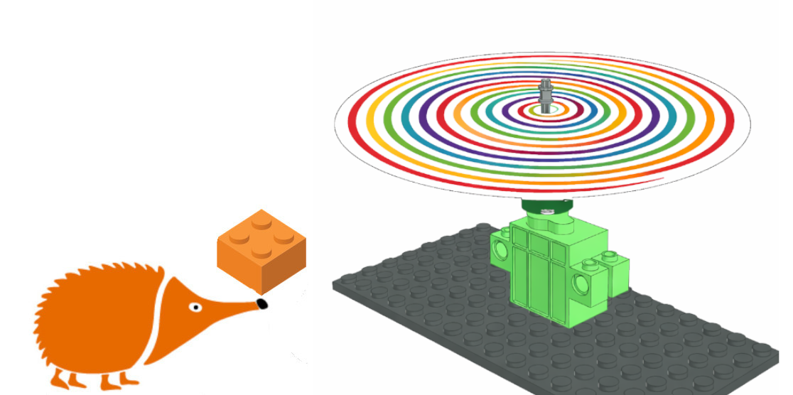
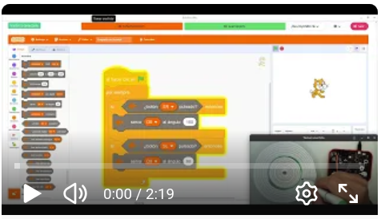

# Rotógrafo
Diseñamos un dispositivo para crear arte en espiral

## Guía de montaje

- [Instrucciones en PDF](rot%C3%B3grafolpub3d_150_DPI.pdf)

- [Gif animado con las instrucciones paso a paso](rot%C3%B3grafol.gif)

## Proyecto en EchidnaML

[Descarga el archivo .sb3 para EchidnaML](rotografo.sb3)

## Vídeo

